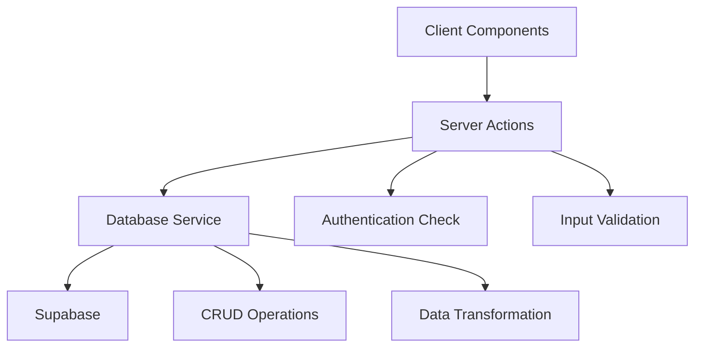
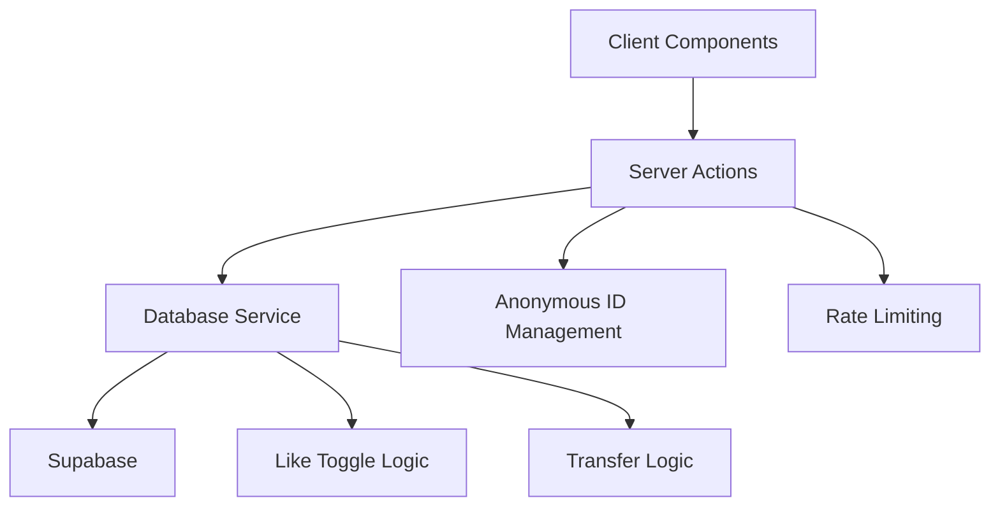
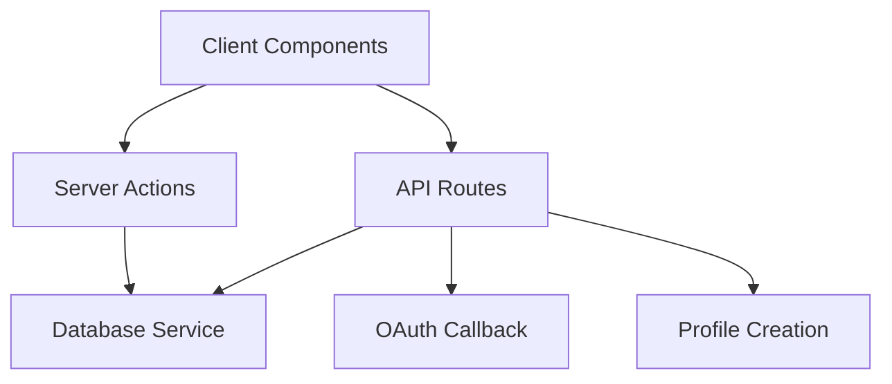
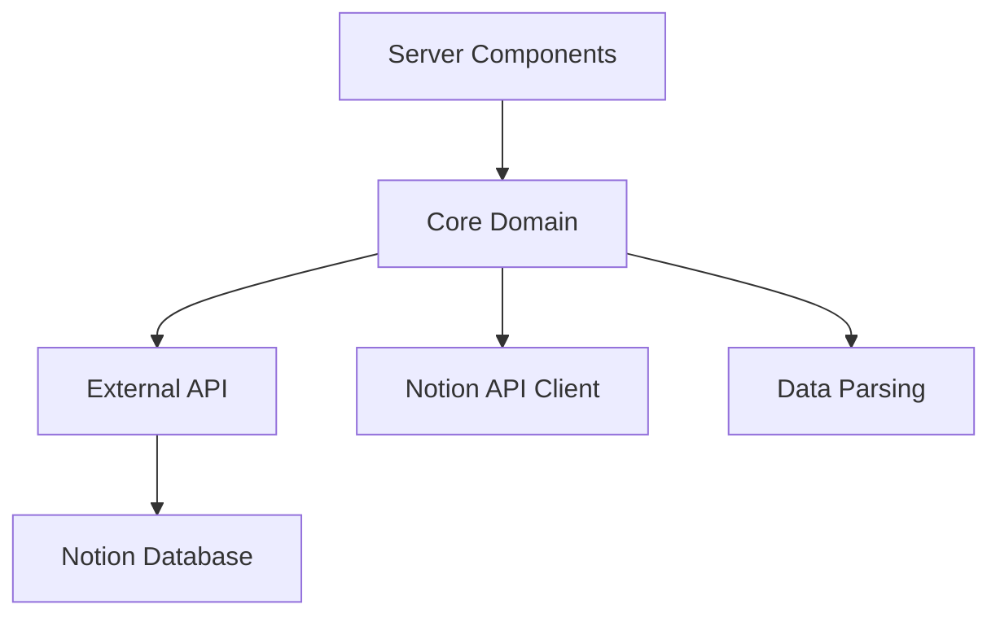
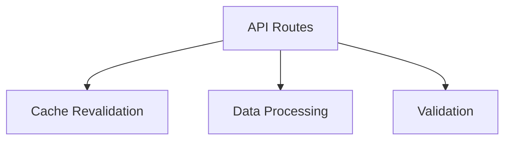

# 백엔드 아키텍처 분석 보고서

**작성일**: 2025-08-15  
**프로젝트**: Blog Platform with Next.js 15 + Supabase  
**분석 범위**: Server-side 아키텍처 및 레이어 구조

## 📋 개요

이 문서는 현재 프로젝트의 백엔드 구조를 분석하고, 각 레이어의 책임과 도메인별 구현 상태를 검토한 결과입니다. 또한 향후 개선 방향성을 제시합니다.

## 🏗️ 현재 레이어 구조

### 1. API Layer (Routes)
**위치**: `src/app/api/`, `src/app/auth/callback/`

**책임**:
- HTTP 요청/응답 처리
- Webhook 처리 (Notion)
- OAuth 콜백 처리
- Orchestration (여러 서비스 조합)

**구현 파일**:
- `src/app/api/revalidate/route.ts`
- `src/app/api/webhook/notion/route.ts`
- `src/app/auth/callback/route.ts`

### 2. Server Actions Layer
**위치**: `src/app/actions/`

**책임**:
- 클라이언트-서버 통신 인터페이스
- 사용자 인증 상태 확인
- 입력 데이터 검증
- 비즈니스 로직 조합

**구현 파일**:
- `src/app/actions/auth.ts`
- `src/app/actions/comments.ts`
- `src/app/actions/likes.ts`

### 3. Database Service Layer
**위치**: `src/lib/supabase/`

**책임**:
- 데이터베이스 CRUD 작업
- RPC 함수 호출
- 트랜잭션 처리
- 데이터 변환

**구현 파일**:
- `src/lib/supabase/comments.ts`
- `src/lib/supabase/likes.ts`
- `src/lib/supabase/profiles.ts`
- `src/lib/supabase/auth.ts`

### 4. Core Domain Layer
**위치**: `src/lib/core/`

**책임**:
- 외부 서비스 통합 (Notion API)
- 도메인 특화 비즈니스 로직
- 데이터 파싱 및 변환

**구현 파일**:
- `src/lib/core/notion.ts`
- `src/lib/core/seo.ts`

### 5. Validation Layer
**위치**: `src/lib/validation/`

**책임**:
- 스키마 검증
- 입력 데이터 sanitization
- 타입 안전성 보장

**구현 파일**:
- `src/lib/validation/schemas.ts`
- `src/lib/validation/validator.ts`

## 🎯 도메인별 책임 분석

### Comments 도메인 ✅ **잘 구성됨**



**아키텍처 플로우**:
1. **Client Components** → `CommentForm`, `CommentList`
2. **Server Actions** → `submitComment()`, `transferUserComments()`
3. **Database Service** → `createComment()`, `getComments()`
4. **Supabase** → RPC functions, row-level security

**장점**:
- 명확한 레이어 분리
- 일관된 에러 처리
- 적절한 권한 검증

### Likes 도메인 ✅ **잘 구성됨**



**아키텍처 플로우**:
1. **Client Components** → `LikeButton`
2. **Server Actions** → `toggleLike()`, `transferUserLikes()`
3. **Database Service** → `toggleLike()`, `getLikeCount()`
4. **Supabase** → Complex queries, constraint handling

**장점**:
- 하이브리드 익명 식별 시스템
- Optimistic UI 지원
- 스팸 방지 메커니즘

### Auth 도메인 ⚠️ **부분적 문제**



**현재 구조**:
- **Server Actions**: OAuth 시작 (`signInWithGitHub`)
- **API Routes**: OAuth 콜백 처리
- **Database Service**: 프로필 생성, 데이터 이전

**문제점**:
- OAuth 콜백이 API Route에서 직접 처리
- 다른 도메인과 다른 패턴
- 복잡한 orchestration 로직이 API Layer에 집중

### Posts 도메인 ❌ **레이어 혼재**



**현재 구조**:
- **Server Components**에서 직접 `notion.ts` 호출
- **Server Actions Layer** 없음
- 캐싱과 비즈니스 로직이 혼재

**문제점**:
- 레이어 건너뛰기 (Server Component → Core Domain)
- 일관성 없는 패턴
- 테스트 및 모킹 어려움

### Webhooks ❌ **단일 레이어**



**현재 구조**:
- 모든 로직이 API Route에 집중
- Service Layer 없음

**문제점**:
- 단일 책임 원칙 위반
- 재사용성 낮음
- 테스트 어려움

## 🚀 개선 방향성

### A. 일관된 레이어 패턴 적용

#### 1. Auth 도메인 개선

**현재**:
```typescript
// src/app/auth/callback/route.ts
export async function GET(request: NextRequest) {
  // OAuth 콜백 처리
  // 프로필 생성
  // 데이터 이전
  // 리다이렉트
}
```

**개선 후**:
```typescript
// src/app/actions/auth.ts
export async function handleOAuthCallback(
  code: string, 
  anonymousUserId?: string
): Promise<AuthResult>

// src/app/auth/callback/route.ts
export async function GET(request: NextRequest) {
  const code = searchParams.get('code')
  const result = await handleOAuthCallback(code, anonymousUserId)
  return redirect(result.redirectUrl)
}
```

#### 2. Posts 도메인 개선

**현재**:
```typescript
// Server Component에서 직접 호출
import { getPostBySlug } from '@/lib/core/notion'
const post = await getPostBySlug(params.slug)
```

**개선 후**:
```typescript
// src/app/actions/posts.ts
export async function getPost(slug: string): Promise<PostResult>
export async function getPosts(filters?: PostFilters): Promise<PostsResult>

// src/lib/services/posts.ts
export async function fetchPostFromNotion(id: string)
export async function transformNotionData(data: NotionResponse)
```

#### 3. Webhooks 개선

**현재**:
```typescript
// API Route에 모든 로직
export async function POST(request: NextRequest) {
  // 웹훅 검증
  // 데이터 파싱
  // 캐시 무효화
  // 로깅
}
```

**개선 후**:
```typescript
// src/app/actions/webhooks.ts
export async function handleNotionWebhook(payload: WebhookPayload)

// src/lib/services/cache.ts
export async function invalidatePostCache(postId: string)
```

### B. 도메인별 패키지 구조

#### 현재 구조의 문제점
- 기능별로 파일이 분산됨
- 도메인 간 의존성이 불명확
- 레이어별 책임이 혼재

#### 개선된 구조

```
src/
├── domains/
│   ├── auth/
│   │   ├── actions.ts      # Server Actions
│   │   ├── service.ts      # Database Service
│   │   ├── types.ts        # Domain Types
│   │   └── validation.ts   # Domain Validation
│   ├── posts/
│   │   ├── actions.ts
│   │   ├── service.ts
│   │   ├── notion.ts       # External API
│   │   └── types.ts
│   ├── comments/
│   │   ├── actions.ts
│   │   ├── service.ts
│   │   ├── types.ts
│   │   └── validation.ts
│   └── likes/
│       ├── actions.ts
│       ├── service.ts
│       ├── types.ts
│       └── validation.ts
├── lib/
│   ├── database/           # Database utilities
│   │   ├── client.ts
│   │   ├── migrations.ts
│   │   └── types.ts
│   ├── validation/         # Shared validation
│   │   ├── schemas.ts
│   │   └── validator.ts
│   └── utils/              # Shared utilities
│       ├── cache.ts
│       ├── security.ts
│       └── helpers.ts
└── app/
    ├── actions/            # Re-export domain actions
    │   ├── index.ts        # export * from domains
    │   └── middleware.ts   # Shared middlewares
    ├── api/                # Thin API layer
    │   └── webhooks/
    └── (pages)/            # UI components
```

### C. 추가 개선 사항

#### 1. 에러 처리 표준화

```typescript
// 모든 레이어에서 일관된 에러 타입 사용
export interface DomainResult<T> {
  success: boolean
  data?: T
  error?: string
  code?: string
}

// 도메인별 에러 코드
export enum ErrorCodes {
  AUTH_UNAUTHORIZED = 'AUTH_001',
  POST_NOT_FOUND = 'POST_001',
  COMMENT_RATE_LIMITED = 'COMMENT_001',
  LIKE_DUPLICATE = 'LIKE_001'
}
```

#### 2. 미들웨어 레이어 추가

```typescript
// 횡단 관심사 처리
export function withAuth<T>(action: ServerAction<T>): ServerAction<T>
export function withValidation<T>(schema: ZodSchema, action: ServerAction<T>)
export function withRateLimit<T>(action: ServerAction<T>): ServerAction<T>
export function withLogging<T>(action: ServerAction<T>): ServerAction<T>

// 사용 예시
export const createComment = withLogging(
  withRateLimit(
    withAuth(
      withValidation(commentSchema, _createComment)
    )
  )
)
```

#### 3. 캐싱 전략 일관화

```typescript
// 도메인별 캐싱 정책
export const CACHE_CONFIG = {
  posts: { 
    revalidate: 3600,     // 1시간
    tags: ['posts'] 
  },
  comments: { 
    revalidate: 60,       // 1분
    tags: ['comments'] 
  },
  likes: { 
    revalidate: 30,       // 30초
    tags: ['likes'] 
  }
} as const

// 캐시 헬퍼 함수
export async function getCachedPosts(filters: PostFilters) {
  return unstable_cache(
    () => fetchPosts(filters),
    ['posts', JSON.stringify(filters)],
    { revalidate: CACHE_CONFIG.posts.revalidate }
  )()
}
```

#### 4. 타입 안전성 강화

```typescript
// 도메인별 강타입 정의
export type PostId = string & { readonly brand: unique symbol }
export type CommentId = string & { readonly brand: unique symbol }
export type UserId = string & { readonly brand: unique symbol }

// 타입 가드
export function isValidPostId(id: string): id is PostId {
  return /^[a-f0-9-]{36}$/.test(id)
}
```

## 📅 우선순위 개선 제안

### High Priority
1. **Posts 도메인에 Server Actions 레이어 추가**
   - 예상 소요 시간: 1-2일
   - 영향도: 높음 (SEO, 캐싱, 성능)
   - 현재 가장 불일치하는 패턴

2. **에러 처리 표준화**
   - 예상 소요 시간: 1일
   - 영향도: 전체 도메인
   - 디버깅 및 모니터링 개선

### Medium Priority
3. **Auth 도메인 OAuth 콜백 패턴 일관화**
   - 예상 소요 시간: 1일
   - 영향도: 중간 (사용자 경험)
   - 보안 및 유지보수성 향상

4. **Webhooks 로직을 Service Layer로 분리**
   - 예상 소요 시간: 1일
   - 영향도: 중간 (개발자 경험)
   - 테스트 가능성 향상

### Low Priority
5. **도메인별 패키지 구조로 리팩토링**
   - 예상 소요 시간: 3-5일
   - 영향도: 장기적
   - 큰 규모의 변경이므로 신중히 계획

6. **미들웨어 레이어 추가**
   - 예상 소요 시간: 2-3일
   - 영향도: 장기적
   - 코드 중복 제거 및 일관성 향상

## 🎯 성공 지표

### 기술적 지표
- **코드 중복률 감소**: 현재 추정 30% → 목표 10%
- **테스트 커버리지 향상**: 현재 추정 40% → 목표 80%
- **빌드 시간 최적화**: 타입 체크 및 린팅 시간 단축

### 개발자 경험 지표
- **새로운 기능 개발 속도 향상**
- **버그 재현 및 수정 시간 단축**
- **코드 리뷰 시간 단축**

### 운영 지표
- **에러 추적 정확도 향상**
- **성능 모니터링 개선**
- **캐시 효율성 증대**

## 📚 참고 자료

### 현재 잘 구현된 패턴 (참고용)
- **Comments 도메인**: `src/app/actions/comments.ts`, `src/lib/supabase/comments.ts`
- **Likes 도메인**: `src/app/actions/likes.ts`, `src/lib/supabase/likes.ts`

### 개선이 필요한 패턴
- **Posts 도메인**: `src/lib/core/notion.ts`
- **Auth 콜백**: `src/app/auth/callback/route.ts`
- **Webhooks**: `src/app/api/webhook/notion/route.ts`

---

**마지막 업데이트**: 2025-08-15  
**다음 리뷰 예정일**: 2025-09-15 (구현 진행 상황에 따라 조정)